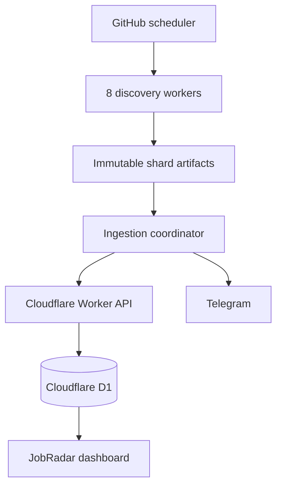

# JobRadar distributed architecture

## Decision

JobRadar uses independently executable stateless services rather than always-on containers. Eight discovery workers divide the official-source registry with a stable SHA-256 ownership function. Each worker produces an immutable scan artifact. A single coordinator validates completeness, deduplicates candidates, sends bounded idempotent ingestion batches, records one run, and delivers Telegram notifications. The Cloudflare Worker remains the API gateway/read service, D1 remains the system of record, and the frontend deploys independently.

This is a microservice execution model without paid orchestration: each discovery worker can fail, retry, and scale independently, while the coordinator protects cross-source consistency. The dashboard and API deliberately remain one edge service because they share a read model and have not shown an independent scaling bottleneck; splitting them now would increase operational cost without improving scan throughput.

## HLD

## LLD and contracts

| Service | Input | Output | Scaling and isolation |
|---|---|---|---|
| Discovery worker | Registry plus shard index/count | Versioned JSON artifact | Stateless horizontal matrix; no production secrets |
| Coordinator | Complete set of version-compatible artifacts | Bounded API batches and alerts | Singleton prevents duplicate finalization and notifications |
| Ingestion API | Companies, batches of up to 125 jobs, final run | Deduplicated D1 records and notification keys | Idempotent on `(ats_provider, external_job_id)` |
| Dashboard API | Browser GET | Active jobs, source health, run history | Cloudflare edge distribution |

Artifact invariants:

- Exactly one artifact is required for every index from `0` to `shard_count - 1`.
- Every enabled source must have exactly one owner and one status record.
- Jobs are deduplicated by ATS provider and external job ID before ingestion.
- A run is finalized only after all artifacts and all ingestion batches succeed.
- A partial distributed failure leaves the previous completed run authoritative.

## Load, payload, and failure controls

- Stable sharding keeps retries predictable and balances hundreds of sources.
- Per-worker source and provider semaphores cap outbound load; Workday receives stricter limits.
- Candidate-only artifacts avoid moving irrelevant descriptions.
- Descriptions are capped at 4,000 characters and ingestion batches at 125 jobs.
- HTTP retries use exponential backoff; job IDs and notification records make replay safe.
- Workflow concurrency queues overlapping schedules instead of corrupting a running scan.
- Artifacts expire after one day and do not contain credentials.

## Free-tier rationale

The architecture reuses GitHub-hosted workflow runners for burst compute and Cloudflare Workers/D1 for the edge API and storage. It adds no queue, Kubernetes cluster, VM, paid proxy, or continuously running service. If the registry grows beyond practical workflow limits, the artifact contract can move unchanged to Cloudflare Queues or another broker later.
